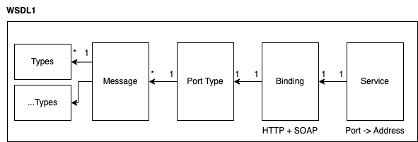
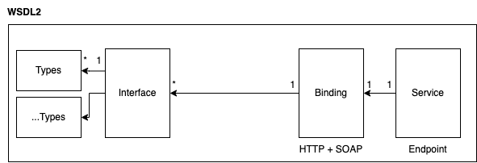

# WSDL Reader

This package provides tools for reading WSDL files and to converting them to metadata that will be used in other parts of the php-soap packages. 

# Want to help out? 💚

- [Become a Sponsor](https://github.com/php-soap/.github/blob/main/HELPING_OUT.md#sponsor)
- [Let us do your implementation](https://github.com/php-soap/.github/blob/main/HELPING_OUT.md#let-us-do-your-implementation)
- [Contribute](https://github.com/php-soap/.github/blob/main/HELPING_OUT.md#contribute)
- [Help maintain these packages](https://github.com/php-soap/.github/blob/main/HELPING_OUT.md#maintain)

Want more information about the future of this project? Check out this list of the [next big projects](https://github.com/php-soap/.github/blob/main/PROJECTS.md) we'll be working on.

# Installation

```bash
composer require php-soap/wsdl-reader
```

## Example usage

```php
use Soap\Engine\Metadata\Model\Method;
use Soap\Engine\Metadata\Model\Type;
use Soap\Wsdl\Loader\FlatteningLoader;
use Soap\Wsdl\Loader\StreamWrapperLoader;
use Soap\WsdlReader\Formatter\ShortMethodFormatter;
use Soap\WsdlReader\Formatter\ShortTypeFormatter;
use Soap\WsdlReader\Metadata\Wsdl1MetadataProvider;
use Soap\WsdlReader\Wsdl1Reader;

// Reading WSDL
$loader = new FlatteningLoader(new StreamWrapperLoader());
$wsdl = (new Wsdl1Reader($loader))($wsdlLocation);

// Parsing metadata
$metadataProvider = new Wsdl1MetadataProvider($wsdl);
$metadata = $metadataProvider->getMetadata();

// Processing collected info:
var_dump($metadata->getMethods(), $metadata->getTypes());
```

As shown above, parsing the WSDL is done in phases:

* Select any [loader](https://github.com/php-soap/wsdl#wsdl-loader) to load the content of the WSDL. Tip: make sure to flatten it!
* Reading raw WSDL XML into value objects and [XSD schema](https://github.com/goetas-webservices/xsd-reader).
* Converting this WSDL to usable metadata

This gives you the flexibility in all different layers:

* You can specify how a WSDL will be loaded.
* You can use the WSDL classes of this package to run your own data lookups/manipulations.
* You can use the provided metadata to run your own data lookups/manipulations.
* ...


## Readers

This package provides some configurable WSDL readers.
This gives you some flexibility in what version of WSDL is being parsed, what SOAP version you want to use, ...

### WSDL1 and 1.1



```php
use Soap\WsdlReader\Locator\ServiceSelectionCriteria;
use Soap\WsdlReader\Metadata\Wsdl1MetadataProvider;
use Soap\WsdlReader\Model\Definitions\SoapVersion;
use Soap\WsdlReader\Wsdl1Reader;

$wsdl = (new Wsdl1Reader($loader))($wsdlLocation);

$criteria = ServiceSelectionCriteria::defaults()
    ->withPreferredSoapVersion(SoapVersion::SOAP_12);

$metadataProvider = new Wsdl1MetadataProvider($wsdl, $criteria);
```

The WSDL1Reader accepts a `ParserContext`. You don't have to configure it since it falls back to defaults.
But if you want to configure things like known XSD schema locations, that would be the place to go!

Once the WSDL1 file has been read, it will try to find a SOAP 1.2 service from your WSDL file.
This service will be converted into metadata you, as a human, can understand.

You can apply additional service selection criteria that will be used to find the SOAP service you prefer. By default,

* The selection criteria allows any SOAP service. You can disable e.g. the HTTP-based SOAP services.
* no SOAP version is preferred. The first SOAP service the system detects, will be selected. But you can specify a specific soap version as well.


### WSDL2



**Not implemented yet!**


## Console

This package extends the WSDL CLI Tools that are provided by the [WSDL package](https://github.com/php-soap/wsdl#wsdl-cli-tools).
It provides these additional commands:

```shell
$ ./vendor/bin/wsdl

Available commands:
  inspect         Inspects WSDL file.
  inspect:method  Inspects a method of a WSDL file.
  inspect:type    Inspects types from WSDL file.
```

### Listing all contents

```shell
./vendor/bin/wsdl inspect your.wsdl
```

### Method details

```shell
./vendor/bin/wsdl inspect:method your.wsdl SomeMethodName
```

### Type details

```shell
./vendor/bin/wsdl inspect:type your.wsdl SomeType
```

### Custom WSDL Loader

By default, all CLI tools use the StreamWrapperLoader.
All CLI tools have a `--loader=file.php` option that can be used to apply a custom WSDL loader.
This can be handy if your WSDL is located behind authentication or if you want to get control over the HTTP level.

Example custom PHP loader:

```php
<?php

use Soap\Wsdl\Loader\FlatteningLoader;
use Soap\Wsdl\Loader\StreamWrapperLoader;

return new FlatteningLoader(
    StreamWrapperLoader(
        stream_context_create([
            'http' => [
                'method' => 'GET',
                'header'=> sprintf('Authorization: Basic %s', base64_encode('username:password')),
            ],        
        ])
    )
);
```

